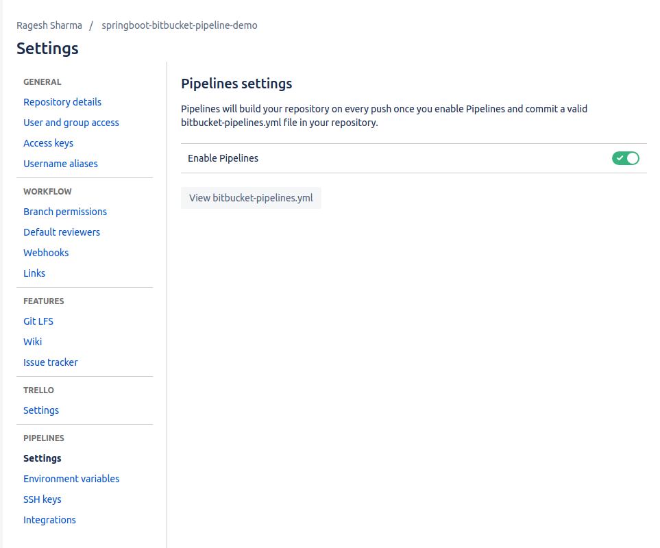
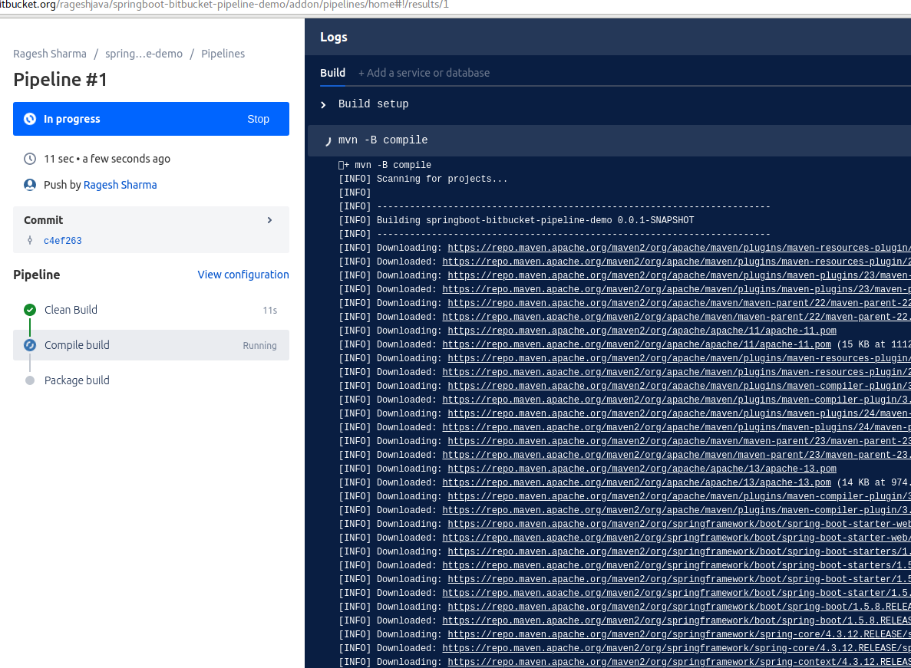

# Springboot Bitbucket Pipeline Example #

This is the demo project of Springboot Rest API using Swagger and showed how to configure pipeline in bitbucket.

# Bitbucket Pipeline #

# Swagger #
* Swagger Service URL : http://localhost:8085/swagger-ui.html
* Implementated Swagger in SpringBoot Rest Controller
* Swagger provides several features to implement the REST API.
    * Documentation like REST API
    * Everyone can understand the API very easily from the UI itself.
    * We can do the testing of each service method from the UI itself. 
    
# Bitbucket Pipeline #
Bitbucket Pipelines brings continuous integration and delivery to Bitbucket Cloud, empowering teams to build, test, and deploy their code within Bitbucket.

* Create a bitbucket-pipelines.yml file in the root directory
* In this application, i have used maven image for making build through pipeline for every commit.
* So the file content should be like this. (Note : you can use any image in the pipeline for CI and CD.)
```
# This is a sample build configuration for Java (Maven).
# Check our guides at https://confluence.atlassian.com/x/zd-5Mw for more examples.
# Only use spaces to indent your .yml configuration.
# -----
# You can specify a custom docker image from Docker Hub as your build environment.
image: maven:3.3.9

pipelines:
  default:
    - step:
        caches:
          - maven
        script: # Modify the commands below to build your repository.
          - mvn -B verify # -B batch mode makes Maven less verbose

```

* In this application, I have used maven image in pipeline so that the user commits each file the pipeline will be called automatically and make a build.

* You can also create multiple step in bitbucket-pipelines.yml file.

# Screenshot - Springboot Bitbucket Pipeline Enable #



# Screenshot - Springboot Bitbucket Pipeline Output #



### Happy Coding ###